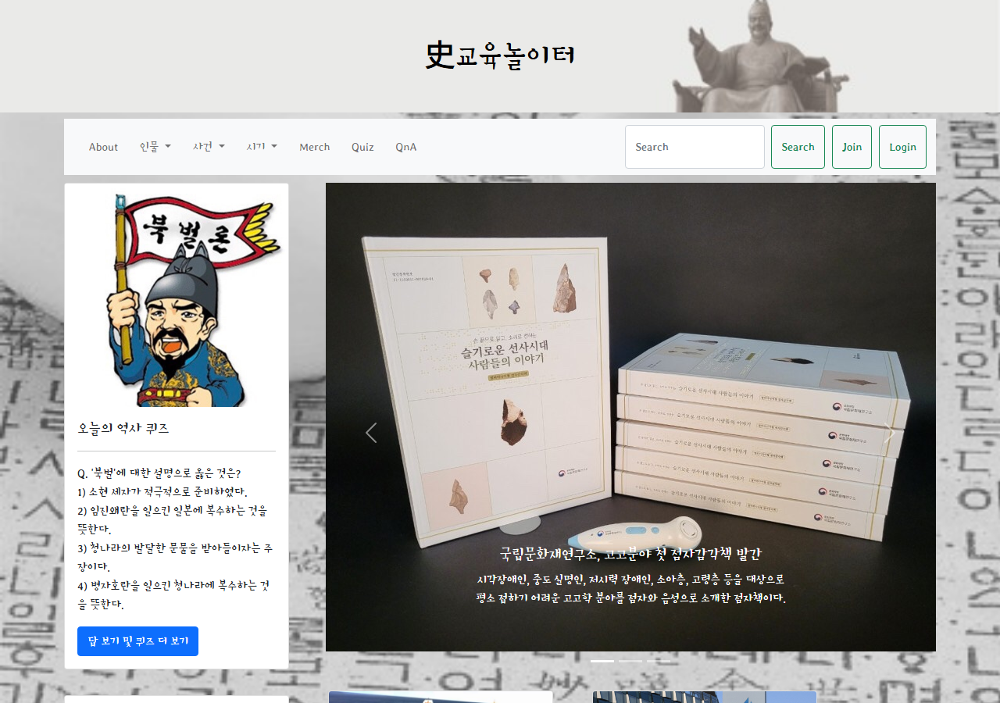
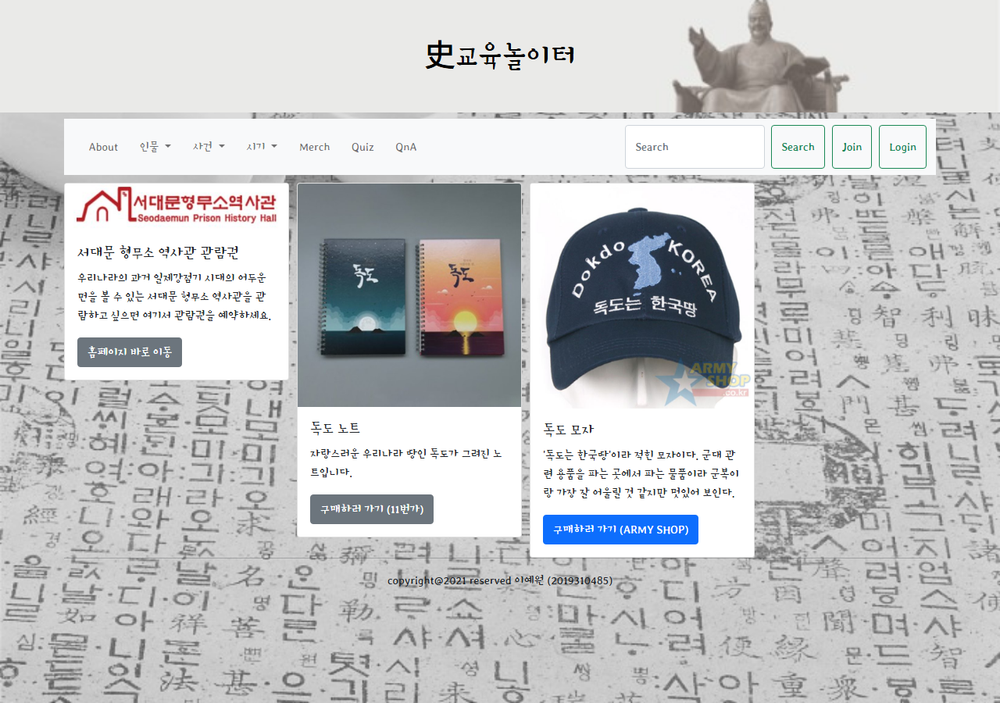
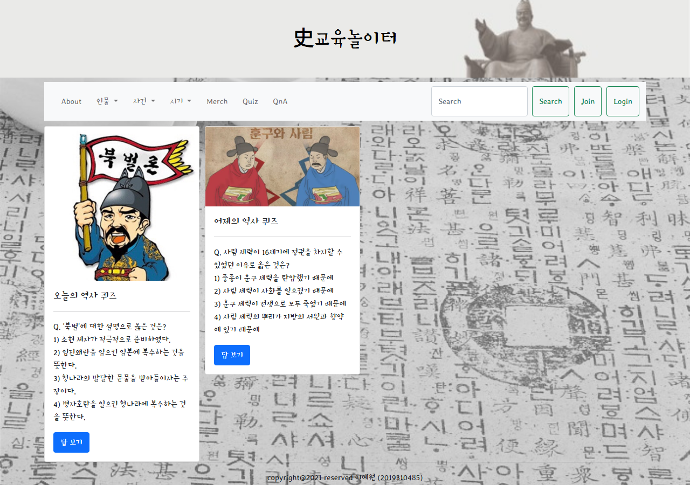
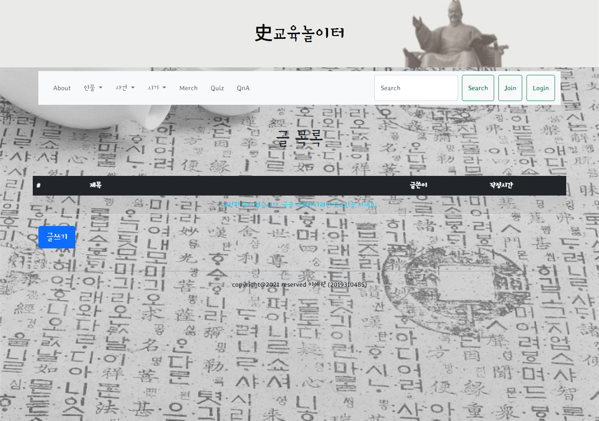
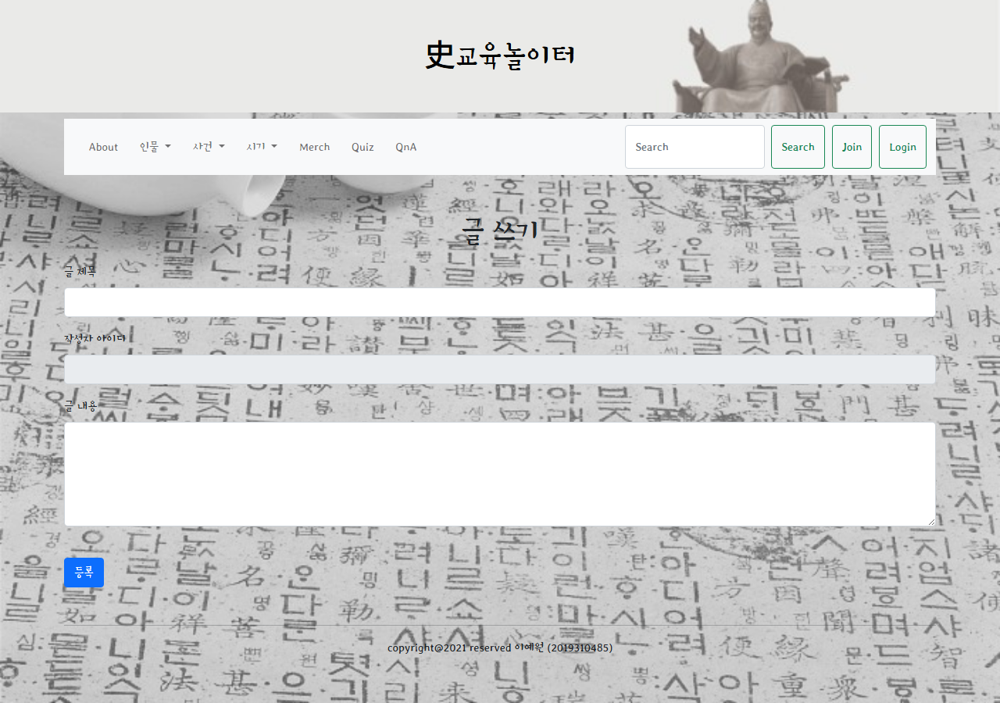
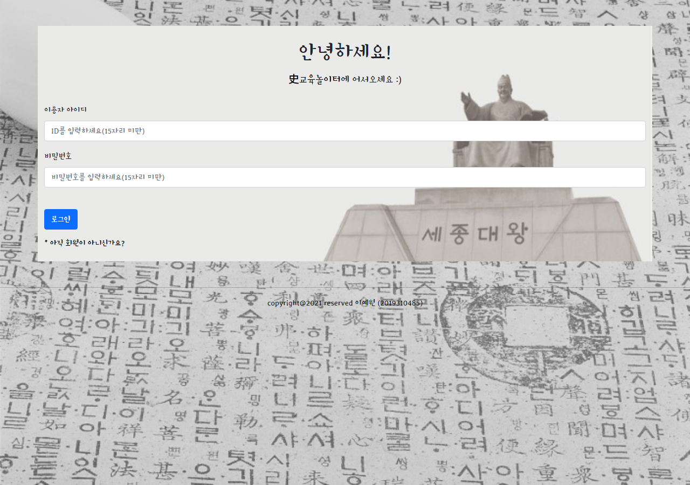
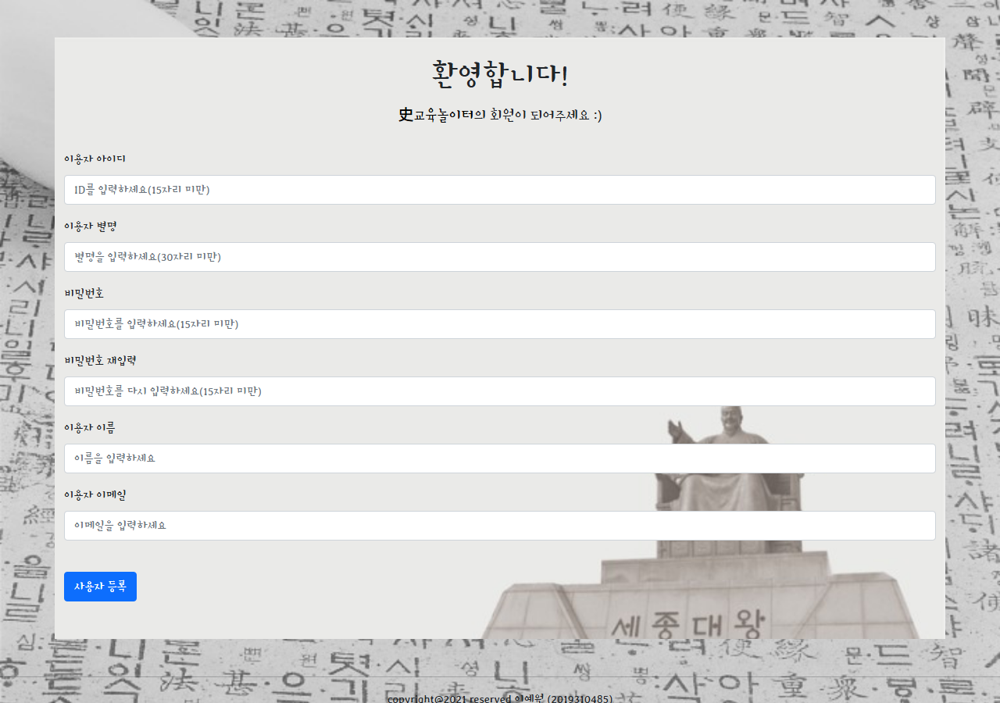

# Hiseduplay

Hiseduplay는 한국사 콘텐츠, 퀴즈, 역사 관련 상품 페이지, Q&A 게시판을 제공하는 Django 프로젝트입니다.

## 개요

이 프로젝트는 사학 전공 배경과 웹 개발을 결합해 만든 개인 대학 프로젝트입니다. 작은 웹사이트를 통해 한국사 콘텐츠를 더 쉽게 탐색할 수 있도록 하고, 퀴즈, 상품, 회원, Q&A 기능을 함께 제공하는 것이 목표입니다.

원본 프로젝트 진행 기간: 2021.11.22 - 2021.12.15.

## 프로젝트 주요 내용

- 한국사 콘텐츠를 공유하기 위해 만든 개인 Django 웹 프로젝트입니다.
- 홈 페이지, 퀴즈 페이지, 상품 페이지, 회원가입/로그인, Q&A 게시판을 포함합니다.
- 레거시 `MEMBER` 테이블 기반의 커스텀 `Member` 모델을 사용합니다.
- 현재 private 유지보수 브랜치는 더 안전한 로컬 개발을 위해 정리되었습니다. 시크릿은 환경 변수 기반으로 관리하고, 생성 파일은 Git에서 제외하며, 핵심 동작에 대한 회귀 테스트를 추가했습니다.

## 기능 소개

### Home

홈 페이지는 서비스 소개, 오늘의 역사 퀴즈 미리보기, 역사 관련 카드 및 뉴스 콘텐츠 링크를 제공합니다.



### Merchandise

Merchandise 페이지는 역사 관련 상품을 보여줍니다. 구매 동작은 로그인이 필요하도록 설계되었습니다.



### Quiz

Quiz 페이지는 한국사 관련 문제와 답을 제공합니다.



### Q&A

Q&A 기능에서는 질문 목록을 확인하고, 글을 작성하고, 질문 상세 페이지를 열고, 답변을 추가할 수 있습니다.





### Member Flow

이 프로젝트에는 커스텀 회원 로그인 및 회원가입 페이지가 포함되어 있습니다. 유지보수된 버전에서는 새로 가입하는 사용자의 비밀번호를 해싱하고, 기존 평문 비밀번호는 로그인 성공 시 해시된 비밀번호로 자동 업그레이드합니다.





## 기술 스택

- Python 3.11
- Django 3.2
- 로컬 개발용 SQLite
- 배포 환경에서 설정 가능한 MySQL

## 최근 유지보수 개선 사항

- 커밋되어 있던 시크릿, 로컬 데이터베이스, 바이트코드, 오래된 프로젝트 스캐폴딩을 제거했습니다.
- 재현 가능한 설치 및 실행 방법을 추가했습니다.
- 새 회원가입에는 비밀번호 해싱을 적용했고, 기존 평문 비밀번호는 로그인 시 자동으로 해시 비밀번호로 업그레이드하도록 했습니다.
- Q&A 질문/답변 생성 버그를 수정하고, 광범위한 예외 처리 대신 명시적인 객체 조회와 리다이렉트를 사용하도록 정리했습니다.
- 인증, Q&A 동작, merch/quiz 페이지 렌더링에 대한 집중 테스트를 추가했습니다.

## 프로젝트 구조

```text
hiseduplay/
  manage.py
  config/
  member/
  merch/
  qna/
  static/
  templates/
```

## 로컬 실행 방법

가상환경을 만들고 활성화합니다.

```powershell
python -m venv .venv
.\.venv\Scripts\Activate.ps1
```

의존성을 설치합니다.

```powershell
python -m pip install --upgrade pip
python -m pip install -r requirements.txt
```

로컬 환경 설정 파일을 만듭니다.

```powershell
Copy-Item hiseduplay\.env.example hiseduplay\.env.local
```

데이터베이스 마이그레이션을 실행합니다.

```powershell
Set-Location hiseduplay
python manage.py migrate
```

개발 서버를 실행합니다.

```powershell
python manage.py runserver
```

브라우저에서 `http://127.0.0.1:8000/`을 엽니다.

## MySQL 설정

MySQL을 사용할 경우 선택 의존성 파일을 설치합니다.

```powershell
python -m pip install -r requirements-mysql.txt
```

그 다음 `hiseduplay/.env.local` 파일을 MySQL 값으로 수정합니다.

```text
DJANGO_DB_ENGINE=django.db.backends.mysql
DJANGO_DB_NAME=hiseduplay
DJANGO_DB_USER=your-db-user
DJANGO_DB_PASSWORD=your-db-password
DJANGO_DB_HOST=localhost
DJANGO_DB_PORT=3306
```

## 환경 변수

`hiseduplay/config/settings.py`는 먼저 `hiseduplay/.env`를 읽고, 그 다음 `hiseduplay/.env.local`을 override 모드로 읽습니다. 실제 시크릿 값은 Git에 커밋하지 말고, 무시되는 로컬 파일이나 배포 환경 변수에만 보관해야 합니다.

필수:

- `DJANGO_SECRET_KEY`

선택:

- `DJANGO_DEBUG`
- `DJANGO_ALLOWED_HOSTS`
- `DJANGO_DB_ENGINE`
- `DJANGO_DB_NAME`
- `DJANGO_DB_USER`
- `DJANGO_DB_PASSWORD`
- `DJANGO_DB_HOST`
- `DJANGO_DB_PORT`

## 검증

의존성 설치 후 다음 명령으로 확인할 수 있습니다.

```powershell
Set-Location hiseduplay
python manage.py check
python manage.py migrate
python manage.py test member qna merch
```
